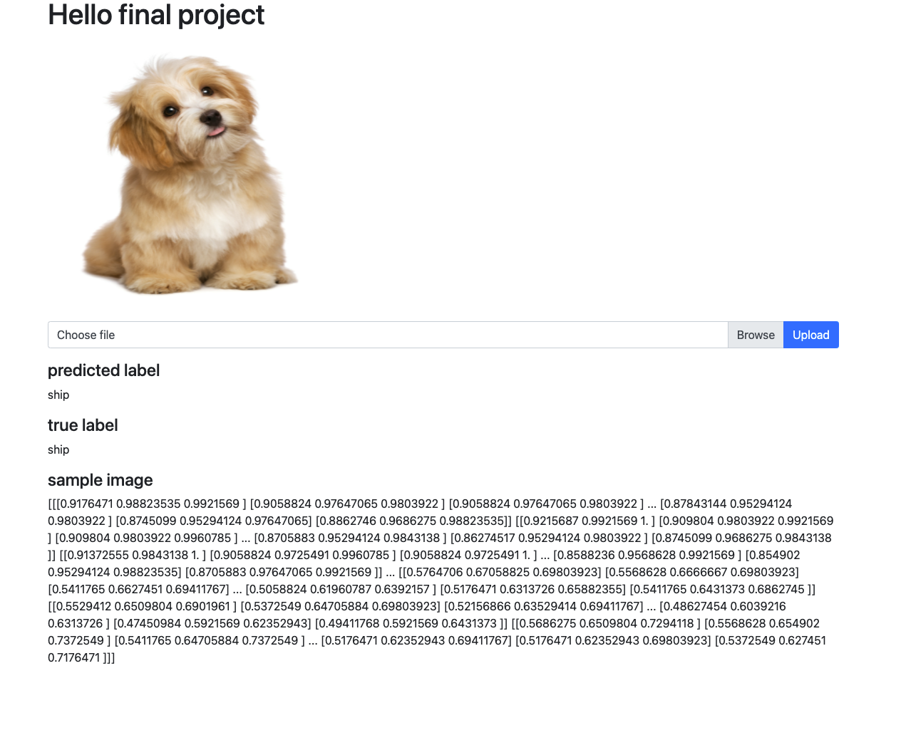

# AP2 - Python  final project 

> This is final project for advanced programming in python course 2.

## Installation

- From [github repository](https://github.com/kuroye/python_final_project2.git).

## Usage

This program is an Image classification app that shows result of image by trained CNN model .

## Examples

**image page** `image/`

**train model** `CNN_train.ipynb`

### License

python_final_project2 is [MIT LICENSE](./LICENSE)

